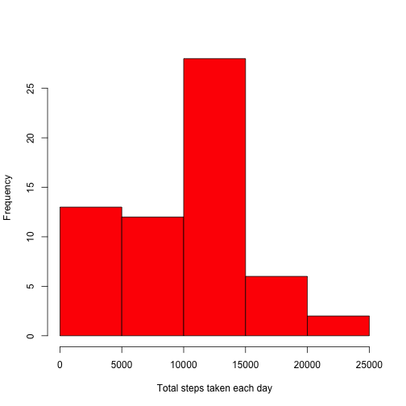
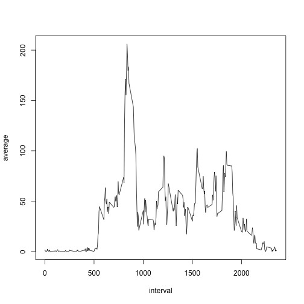
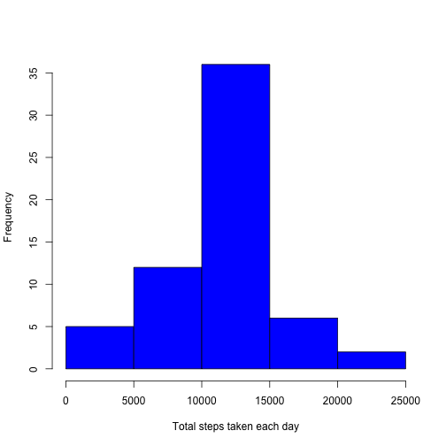
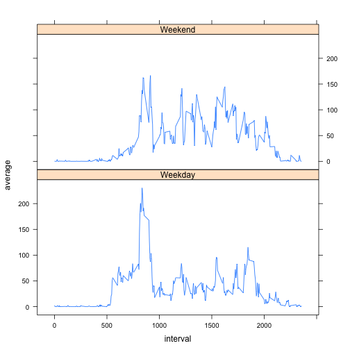

# Reproducible Research: Peer Assessment 1

> This assignment was created as part of the assignments for the [Coursera Reproducible Research](https://www.coursera.org/course/repdata).  

First, we need to load the data and look at the summary of the data.


```r
data <- read.csv("activity.csv", na.strings = "NA")
summary(data)
```

```
##      steps                date          interval     
##  Min.   :  0.00   2012-10-01:  288   Min.   :   0.0  
##  1st Qu.:  0.00   2012-10-02:  288   1st Qu.: 588.8  
##  Median :  0.00   2012-10-03:  288   Median :1177.5  
##  Mean   : 37.38   2012-10-04:  288   Mean   :1177.5  
##  3rd Qu.: 12.00   2012-10-05:  288   3rd Qu.:1766.2  
##  Max.   :806.00   2012-10-06:  288   Max.   :2355.0  
##  NA's   :2304     (Other)   :15840
```

In order for us to be able to take the total number of steps taken per day, we need to group the data by date, then compute the sum of the steps taken each date. Here we want to ignore the NAs, so let's set na.rm to TRUE.


```r
library(dplyr)
by_day <- group_by(data, date)
sums <- summarise(by_day, total = sum(steps, na.rm = TRUE))
```

Here is the first few rows of the result.


```r
head(sums)
```

```
## Source: local data frame [6 x 2]
## 
##         date total
##       (fctr) (int)
## 1 2012-10-01     0
## 2 2012-10-02   126
## 3 2012-10-03 11352
## 4 2012-10-04 12116
## 5 2012-10-05 13294
## 6 2012-10-06 15420
```

And here is the related histogram.


```r
hist(sums$total, xlab = "Total steps taken each day", main = "", col = "red")
```

 

Now that we know the total number of steps taken each day, we can compute the mean and the median.


```r
summary(sums$total)
```

```
##    Min. 1st Qu.  Median    Mean 3rd Qu.    Max. 
##       0    6778   10400    9354   12810   21190
```

As we can see the mean is **9354** steps per day, and the median is **10400** steps.

Let's now take a look at the average steps taken over every 5-minute interval. First we want to group the data by interval, then compute the mean of each interval. Use this to create a scatterplot.


```r
by_interval <- group_by(data, interval)
means_by_interval <- summarise(by_interval, average = mean(steps, na.rm = TRUE))
with(means_by_interval, plot(interval, average, type = "l"))
```

 

And we can find out the interval in which the maximum number of steps taken, on average, by running the following code.


```r
filter(means_by_interval, average == max(means_by_interval$average, na.rm = TRUE))
```

```
## Source: local data frame [1 x 2]
## 
##   interval  average
##      (int)    (dbl)
## 1      835 206.1698
```

As we can see, interval **835** contains on average the max number of steps, **206.1698** steps/interval. This number agrees with the plot shown above. 

For the second part of this assignment, let's now deal with the missing values. When we first load the data, the summary tells us that there are **2304** NAs. Let's now fill in those NAs with the mean of the 5-minute interval.

First, let's filter the data with the NAs and fill in the NAs with the mean of the same 5-minute interval.


```r
data_na <- filter(data, is.na(steps) == TRUE)
data_na$steps <- means_by_interval$average
```

Next, filter the data without the NAs, and combine the NAs data, now filled in with the means, and the no NAs data. The result is the original data with the NAs filled in with the means. 


```r
data_not_na <- filter(data, is.na(steps) == FALSE)
new_data <- rbind(data_na, data_not_na)
```

So now we want to repeat the steps above with the original data using the new data.


```r
new_by_day <- group_by(new_data, date)
new_sums <- summarise(new_by_day, total = sum(steps))
hist(new_sums$total, xlab = "Total steps taken each day", main = "", col = "blue")
```

 

```r
summary(new_sums$total)
```

```
##    Min. 1st Qu.  Median    Mean 3rd Qu.    Max. 
##      41    9819   10770   10770   12810   21190
```

As we can see, the histogram changed, and the mean of the total steps taken each day is **10770** steps, which is equal to the median. These numbers are higher than the original numbers, and this makes sense since we have more data now.

Our next/ last goal is to create a factor variable with two levels: "weekday" and "weekend". To do this, we need to convert the data variable to Date using as.Date function.


```r
new_data$date <- as.Date(new_data$date)
```

Next, let's create a string character week_type that converts the days into either *weekday* or *weekend*, then we ammend this character into the new dataset and convert it into a factor variable.


```r
week_type <- weekdays(new_data$date)
for (i in 1:length(week_type)) {
    if (week_type[i] %in% c("Monday", "Tuesday", "Wednesday", "Thursday", "Friday") == TRUE) {week_type[i] = "Weekday"}
    else if (week_type[i] %in% c("Saturday", "Sunday") == TRUE) {week_type[i] = "Weekend"}
}
new_data <- mutate(new_data, type = as.factor(week_type))
```

Lastly, we use the lattice system to make a panel plot containing a time series plot of the 5-minute interval (x-axis) and the average number of steps taken, averaged across all weekday days or weekend days (y-axis). 


```r
library(lattice)
new_by_interval_type <- group_by(new_data, interval, type)
new_means_by_interval_type <- summarise(new_by_interval_type, average = mean(steps))
xyplot(average ~ interval | type, data = new_means_by_interval_type, layout = c(1,2), type = "l")
```

 

The panel plots show the difference in the activity patterns between weekdays and weekends. On weekends the activities tend to be more uniform throughout the day, while on weekdays the activity seem higher in the morning then get lower as the day goes by.
